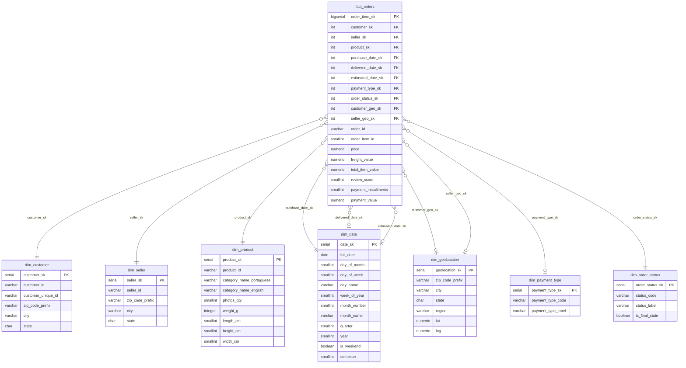

# Modelagem Dimensional — Olist

## O que estamos modelando

O banco cobre o ciclo de pedidos da Olist: do momento da compra até a entrega e avaliação. Coisas como marketing, captação de sellers e operações internas ficaram fora do escopo.

---

## Granularidade

**1 linha na tabela fato = 1 produto dentro de 1 pedido.**

Um pedido pode ter vários produtos, então um `order_id` pode gerar múltiplas linhas. Escolhemos essa granularidade porque é o nível mais detalhado disponível e permite filtrar por produto e vendedor ao mesmo tempo.

Pagamento e review existem no nível do pedido inteiro, então esses valores se repetem em todas as linhas do mesmo pedido. É intencional — evita JOINs extras no BI.

---

## Modelo de Alto Nível


--- 

## Tabelas

**Fato**

| Tabela | Linhas estimadas |
|---|---|
| `fact_orders` | ~112 mil |

**Dimensões**

| Tabela | Fonte | Observação |
|---|---|---|
| `dim_date` | Gerada no Hop | Sem CSV — gerar o range de datas do dataset |
| `dim_customer` | olist_customers_dataset.csv | |
| `dim_seller` | olist_sellers_dataset.csv | |
| `dim_product` | olist_products_dataset.csv + translation.csv | Fazer JOIN no Hop para trazer o nome em inglês |
| `dim_geolocation` | olist_geolocation_dataset.csv | Deduplicar por CEP antes de inserir |
| `dim_payment_type` | — | Já populada pelo DDL (5 tipos) |
| `dim_order_status` | — | Já populada pelo DDL (8 status) |

---

## Atenção: dimensões que aparecem mais de uma vez

`dim_date` e `dim_geolocation` aparecem com papéis diferentes na fato:

- `dim_date` → data de compra, data de entrega, data estimada
- `dim_geolocation` → localização do cliente, localização do vendedor

No Preset, ao montar os datasets, criar aliases nas colunas pra não ter conflito de nomes.

---

## Ordem de carga no Hop

Dimensões primeiro, fato por último:

```
1. dim_date          → gerar no próprio Hop (range das datas do dataset)
2. dim_payment_type  → seed já inserido pelo DDL, pode pular
3. dim_order_status  → seed já inserido pelo DDL, pode pular
4. dim_geolocation   → deduplicar por zip_code_prefix antes de inserir
5. dim_product       → JOIN com translation.csv para trazer category_name_english
6. dim_customer
7. dim_seller
8. fact_orders       → join de order_items + orders + payments + reviews, depois lookup das SKs
```

---

## Conexão com o Supabase

As credenciais ficam em `Supabase > Project Settings > Database > Connection String`.

```
Driver:   org.postgresql.Driver
URL:      jdbc:postgresql://<HOST>:5432/postgres?sslmode=require
User:     postgres
Password: <senha do projeto>
```

O `sslmode=require` é obrigatório — sem ele a conexão cai.

Usar **commit size de 500 linhas** no Table Output. Linha a linha numa conexão em nuvem é muito lento.

---

## Views prontas para o Preset

O DDL já cria duas views que podem ser importadas direto como datasets:

- `vw_sales_overview` — receita, GMV e pedidos agrupados por período, categoria e região
- `vw_delivery_performance` — atrasos, tempo de entrega e nota de review por estado

Usar as views em vez das tabelas brutas poupa bastante tempo na hora de montar os gráficos.

---

## Sugestões de perguntas para o dashboard

1. Como o GMV evoluiu mês a mês?
2. Quais categorias de produto vendem mais — e quais têm pior avaliação?
3. Quais estados concentram mais atrasos na entrega?
4. Como se distribui o pagamento (cartão, boleto, etc.) e qual o ticket médio por tipo?
5. Quais vendedores geram mais receita e como é a performance de entrega deles?
